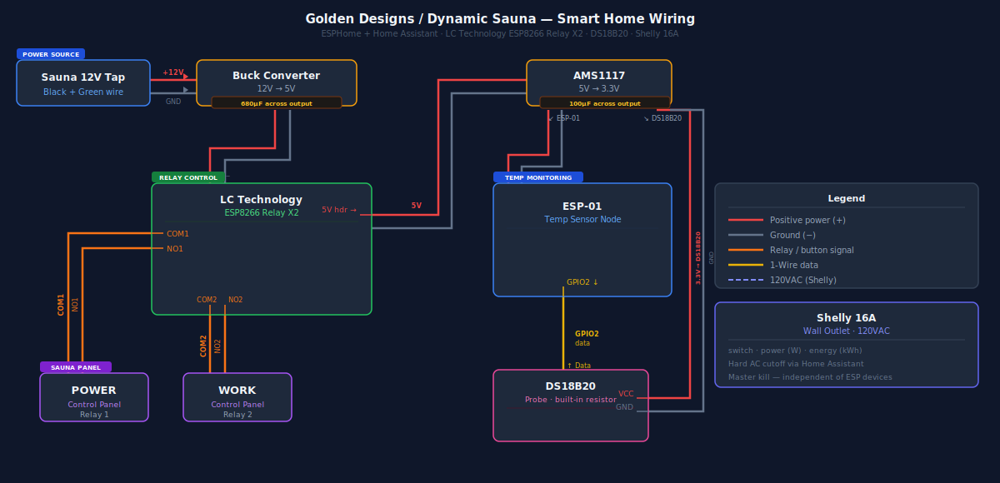

# Golden Designs / Dynamic 2-Person Infrared Sauna — Home Assistant Integration

This guide documents how to add remote pre-heat control and temperature monitoring to a Golden Designs or Dynamic 2-person far-infrared sauna (tested on models using the YT2R-1.4S controller board, including the DYN-6209-01) using ESPHome and Home Assistant. No proprietary app, no cloud dependency, no permanent modifications to the sauna.

---

## Wiring Overview



---

## How the Sauna Controller Works

The YT2R-1.4S (and equivalent CP-150 class) controller is split across two boards:

- **Roof-mounted power supply box** — the brain. Controls the heating elements, houses the fuse, NTC thermal cutoff, and labeled headers for PANEL, CONTROL, HEATER, LIGHTING, LAMPROOF, and DC 12V connections.
- **Inside control panel** — the user interface. Contains the POWER, WORK/START, TEMP, TIME, and LIGHT buttons along with the LED display. Connected to the roof box via a 10-pin Micro-Fit 3.0 harness (the multi-colored ribbon cable).

To start heating, two button presses are required in sequence: POWER (wakes the panel), then WORK (engages the heating elements). Restoring AC power alone does not start the sauna — the controller boots to idle and waits for manual input. This is why a smart outlet alone is insufficient.

---

## Bill of Materials

### Relay Control

| Item | Notes | Approx. Cost |
|---|---|---|
| LC Technology ESP8266 Relay X2 board | ESP-01 based, dual relay, UART-controlled | $10 |
| TOBSUN or equivalent 12V to 5V DC-DC buck converter | Screw terminal type | $8 |
| 680µF electrolytic capacitor | Across 5V output of buck converter | $1 |
| 22 AWG silicone hookup wire | For button pad connections | $8 |
| Molex Micro-Fit 3.0 10-pin connector kit | For 12V power tap from panel harness | $8 |
| Shelly 16A | Power monitor on wall outlet | $25 |

### Temperature Monitoring

| Item | Notes | Approx. Cost |
|---|---|---|
| ESP-01 module | Standalone, not the relay board | $4 |
| AMS1117 3.3V regulator breakout | Powers the temp ESP-01 from 5V | $6 (10-pack) |
| Waterproof DS18B20 module | Breakout board with built-in pull-up resistor | $8 |
| 100µF electrolytic capacitor | Across 3.3V output of AMS1117 | $1 |
| USB-to-serial adapter (FTDI or CH340, 3.3V) | For initial flashing only | $8 |

### Already Assumed

- Home Assistant instance running on your network
- ESPHome add-on installed in Home Assistant
- Basic soldering iron and multimeter

**Total new spend: approximately $55–65**

---

## Why Not Use the OEM Temperature Sensor

The factory NTC thermistor plugs directly into the roof power supply and is part of the thermal safety chain. Tapping it risks adding parallel impedance that skews the controller's temperature reading and can cause premature thermal cutoff or refusal to heat. A separate sensor adds no risk to the OEM safety chain and gives a more useful reading at seated head height rather than the ceiling vent location the factory probe occupies.

---

## Why the Relay Board Cannot Host the Temperature Sensor

The LC Technology ESP8266 Relay X2 board uses an ESP-01 module. The ESP-01 exposes only four GPIOs. GPIO1 and GPIO3 are consumed by the UART interface to the relay controller chip. GPIO0 and GPIO2, while exposed on the programming header, are connected to the relay controller MCU on the board's PCB traces and cannot be used for 1-Wire communication. A dedicated ESP-01 for temperature sensing is the clean solution.

---

## Shelly 16A — Outlet Power Monitor

A Shelly 16A is installed on the wall outlet that the sauna plugs into. It acts as a hard AC master kill controllable from Home Assistant and monitors real power consumption so you can verify the sauna is actually heating.

The Shelly exposes three entities to Home Assistant automatically via its native integration:

- `switch.sauna_outlet` — turns AC power on and off
- `sensor.sauna_outlet_power` — live wattage draw in watts
- `sensor.sauna_outlet_energy` — cumulative energy in kWh

Use `switch.sauna_outlet` as the first action (turn on) and last line of defense (turn off) in all automations. The Shelly operates at the AC mains level independently of the ESPHome devices.

---

## Wiring

### 12V Power Tap

The roof power supply box has labeled connectors. The two connectors silkscreened "12V" on the power supply are switched — only live when the sauna is already powered on. These are not suitable.

The correct 12V source is a pair of wires on the 10-pin Micro-Fit 3.0 harness running between the inside control panel and the roof power supply. On this build the correct pair was the **black and green wire**. This was confirmed by probing with a multimeter in idle state and verifying heater operation was not interrupted when the pair was loaded. Create a Y-splice using a Micro-Fit 3.0 pass-through cable — do not cut the original harness.

`[INSERT PHOTO: Micro-Fit harness with confirmed 12V pair identified]`

### Buck Converter

Connect the 12V pair to the INPUT terminals of the buck converter. Verify 5.0V at the OUTPUT terminals. Connect the 680µF electrolytic capacitor across the OUTPUT terminals observing polarity (long leg to positive). This prevents both ESPs from failing to boot when AC power is restored due to slow voltage ramp-up.

`[INSERT PHOTO: Buck converter with capacitor across output terminals]`

### Relay Board Power

Connect buck converter 5V and GND outputs to the IN+ and IN- screw terminals on the LC Technology relay board. The AMS1117 3.3V regulator for the temperature ESP-01 is powered from the **5V pin on the right-side header of the relay board**, not directly from the buck converter.

### Button Pad Wiring

Open the inside control panel housing. Locate the POWER and WORK/START tactile switches. Use a multimeter in continuity mode to identify the two active terminals on each button. Solder a pair of 22 AWG silicone wires to each button and route them to the roof alongside the existing harness.

At the relay board, connect POWER button wires to Relay 1: COM1 and NO1. Connect WORK button wires to Relay 2: COM2 and NO2. NC terminals are left unconnected.

`[INSERT PHOTO: Control panel PCB with wires on POWER and WORK button pads]`

`[INSERT PHOTO: Relay board with COM and NO terminals wired]`

### Temperature Sensor Wiring

The DS18B20 module VCC and GND are powered directly from the buck converter 5V output — not from the ESP-01. Only the data wire connects to the ESP-01 GPIO2. The module has a pull-up resistor built into its breakout board so no external resistor is needed.

The DS18B20 probe is mounted using aluminum tape in the opening left by the removed 3.5mm aux jack on the inside control panel. The sauna has built-in Bluetooth for audio so the aux port is not needed. The probe tip sits in the interior airspace at approximately seated head height.

`[INSERT PHOTO: DS18B20 module mounted at aux port opening]`

### AMS1117 and Temp ESP-01 Power

The AMS1117 takes 5V from the relay board's header pin and outputs 3.3V. Connect the 100µF capacitor across the 3.3V output. Connect AMS1117 3.3V output to ESP-01 VCC, and GND to ESP-01 GND.

### Mounting

Print PCB standoffs in PETG (not PLA — sauna roof temperatures will warp PLA). Mount all boards to a piece of plywood using standoffs and M3 screws. Screw the plywood to the roof framing beside the existing power supply box.

`[INSERT PHOTO: Completed assembly mounted on roof backplate]`

---

## Flashing ESPHome

Both ESP-01 boards require a USB-to-serial adapter for the initial flash. Use the ESPHome web flasher at **web.esphome.io** in Chrome or Edge — no software installation required.

Set your FTDI or CH340 adapter to **3.3V logic** before connecting anything. 5V logic will damage the ESP-01.

### Flash Mode Wiring

| Adapter | Board header pin |
|---|---|
| GND | GND |
| 5V | 5V (relay board) or AMS1117 input (temp board) |
| TX | RX |
| RX | TX |
| GND | CLK (GPIO0) — hold LOW at power-on to enter flash mode |

Bridge CLK to GND before applying power. Once the flash begins GPIO0 can be released. All subsequent updates are done OTA over WiFi.

`[INSERT PHOTO: FTDI adapter wired to ESP-01 header]`

---

## ESPHome Configuration

### Relay Board — sauna.yaml

```yaml
esphome:
  name: sauna-relay
  friendly_name: sauna-relay

esp8266:
  board: esp01_1m

logger:
  baud_rate: 0

api:
  encryption:
    key: "YOUR_KEY_HERE"

ota:
  - platform: esphome
    password: "YOUR_PASSWORD_HERE"

wifi:
  ssid: !secret wifi_ssid
  password: !secret wifi_password
  min_auth_mode: WPA2

uart:
  tx_pin: GPIO1
  rx_pin: GPIO3
  baud_rate: 115200

switch:
  - platform: template
    internal: true
    id: relay01
    optimistic: true
    restore_mode: ALWAYS_OFF
    turn_on_action:
      - uart.write: [0xA0, 0x01, 0x01, 0xA2]
    turn_off_action:
      - uart.write: [0xA0, 0x01, 0x00, 0xA1]
    on_turn_on:
      - delay: 100ms
      - switch.turn_off: relay01

  - platform: template
    internal: true
    id: relay02
    optimistic: true
    restore_mode: ALWAYS_OFF
    turn_on_action:
      - uart.write: [0xA0, 0x02, 0x01, 0xA3]
    turn_off_action:
      - uart.write: [0xA0, 0x02, 0x00, 0xA2]
    on_turn_on:
      - delay: 100ms
      - switch.turn_off: relay02

button:
  - platform: template
    name: "Sauna Power"
    id: power_button
    icon: mdi:power
    on_press:
      then:
        - switch.turn_on: relay01

  - platform: template
    name: "Sauna Heat"
    id: work_button
    icon: mdi:heat-wave
    on_press:
      then:
        - switch.turn_on: relay02

  - platform: template
    name: "Sauna Start"
    id: start_button
    icon: mdi:sauna
    on_press:
      then:
        - button.press: power_button
        - delay: 1500ms
        - button.press: work_button
```

**Notes:**

- `baud_rate: 0` disables serial logging, freeing GPIO1 and GPIO3 for relay UART
- The `on_turn_on` automation closes each relay for 100ms then opens it, simulating a momentary button press
- `Sauna Start` presses POWER and WORK in sequence with a 1500ms gap — this is the button to use for pre-heat
- Relays restore to ALWAYS_OFF on boot so buttons are never held closed during power cycling

### Temperature Sensor — sauna-temp.yaml

```yaml
esphome:
  name: sauna-temp
  friendly_name: Sauna Temperature

esp8266:
  board: esp01_1m

api:
  encryption:
    key: "YOUR_KEY_HERE"

ota:
  - platform: esphome
    password: "YOUR_PASSWORD_HERE"

wifi:
  ssid: !secret wifi_ssid
  password: !secret wifi_password
  min_auth_mode: WPA2

one_wire:
  - platform: gpio
    pin: GPIO2

sensor:
  - platform: dallas_temp
    name: "Sauna Temperature"
    update_interval: 15s
    filters:
      - filter_out: NAN
      - sliding_window_moving_average:
          window_size: 4
          send_every: 4
```

---

## Ready Notification — Sending to Whoever Started the Sauna

The simplest way to notify the right person is to store who started the session when the button is pressed, then use that to route the notification.

### Step 1 — Create a helper

In Home Assistant go to Settings → Devices and Services → Helpers and create a **Text** helper named `sauna_started_by`. Leave it blank by default.

### Step 2 — Two dashboard buttons (one per person)

Instead of pressing Sauna Start directly, each person presses their own button which sets the helper and starts the sauna. Add two **Button card** actions to your dashboard, each calling a script:

```yaml
# Script for you
sauna_start_me:
  sequence:
    - service: input_text.set_value
      target:
        entity_id: input_text.sauna_started_by
      data:
        value: "notify.mobile_app_your_phone"
    - service: switch.turn_on
      target:
        entity_id: switch.sauna_outlet
    - delay:
        seconds: 5
    - service: button.press
      target:
        entity_id: button.sauna_start
```

```yaml
# Script for your wife
sauna_start_wife:
  sequence:
    - service: input_text.set_value
      target:
        entity_id: input_text.sauna_started_by
      data:
        value: "notify.mobile_app_wife_phone"
    - service: switch.turn_on
      target:
        entity_id: switch.sauna_outlet
    - delay:
        seconds: 5
    - service: button.press
      target:
        entity_id: button.sauna_start
```

Replace `notify.mobile_app_your_phone` and `notify.mobile_app_wife_phone` with your actual mobile app notify service names from Settings → Devices and Services → Mobile App.

### Step 3 — Ready notification automation

```yaml
alias: Sauna Ready Alert
trigger:
  - platform: numeric_state
    entity_id: sensor.sauna_temperature
    above: 55
action:
  - service: "{{ states('input_text.sauna_started_by') }}"
    data:
      message: >
        Sauna is ready. Current temperature: 
        {{ states('sensor.sauna_temperature') }}°C
      title: "Sauna Ready"
```

When the temperature crosses 55°C (adjust to your preferred ready temperature), the notification goes to whichever phone started the session. If neither script was used and the helper is blank the notification will fail silently — which is fine since a manual button press from the ESPHome dashboard does not need a notification routed to a specific person.

---

## Safety Notes

- Keep the Shelly 16A on the wall plug in place as a hard master kill independent of any software state.
- Do not mount any electronics inside the heated cabin. All boards belong on the roof.
- Do not bypass or disconnect the OEM NTC temperature sensor, thermal cutoff, or internal fuse.
- Use PETG or ASA filament for any 3D printed mounting components. PLA will deform at sauna roof temperatures.
- Remote pre-heating before arrival is the intended use case. The OEM 90-minute auto-off timer remains intact as the primary runtime limiter.

---

## Credits and References

- [awholenother.com — Adding remote starter to a Costco infrared sauna](https://www.awholenother.com/2025/06/26/sauna-remote-start.html)
- [awholenother.com — ESPHome sauna controller update](https://www.awholenother.com/2026/02/12/remote-esphome-sauna-controller-update.html)
- [ESPHome one_wire documentation](https://esphome.io/components/one_wire)
- [Tasmota LC Technology device page](https://templates.blakadder.com/LC-ESP01-2R-5V.html)
- [killee/Sauna-controller on GitHub](https://github.com/killee/Sauna-controller)
